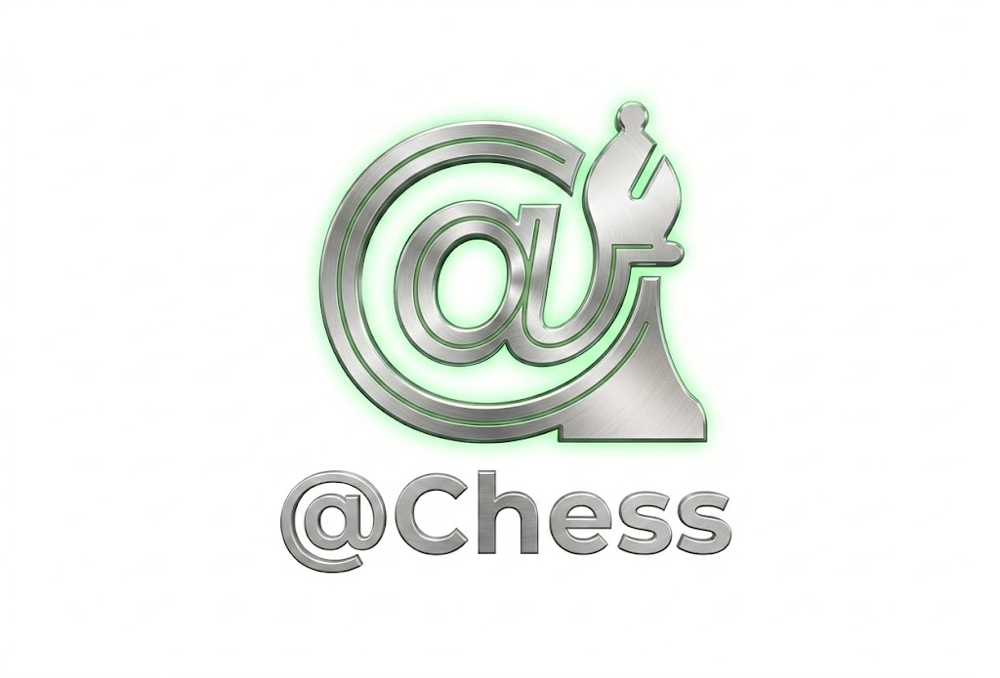

<p align="center">
  
</p>

<h1 align="center">AI Chess Master</h1>

<p align="center">
  A full chess application in Python (Pygame + python-chess) featuring a unified
  modern UI, an alpha-beta AI with an opening book, and a persistent
  <b>experience-replay learning system</b> that makes the engine get stronger
  the more it plays.
</p>

---

## Highlights

- **Full chess rules** via `python-chess` (check, mate, stalemate, 50-move, insufficient material, promotions, castling, en-passant).
- **Alpha-beta AI** with iterative deepening, quiescence, transposition table, killer / history heuristics, and a curated opening book (`ai_agent.py`).
- **Persistent learning brain** (`learning.py` + `ai_memory.json`) — every finished game is ingested and nudges future move ordering via Laplace-smoothed win-rates. Ship the repo, the brain goes with it.
- **Single-window unified app** — menu, time-control picker, color picker and gameplay all live in one Pygame window.
- **Modern UI** — piece sprites, board frame, coordinates, move history with think times, captured material, arrows / square markers for planning, fallen-king animation on game over.
- **Real clocks** — `chess.com`-style time controls (bullet/blitz/rapid, `X|Y` increment) with loss-on-time.

## Prerequisites

- Python 3.8+
- pip

Required Python packages (auto-installed by `run_game.bat`, also listed in `requirements.txt`):

- `chess==1.11.1`
- `pygame==2.6.1`
- `python-chess==1.999`
- `numpy==1.24.3`

## Quick Start (Windows)

1. Double-click `run_game.bat`
2. It will:
   - try to activate the `env_3_8_20` conda env if present, otherwise use system Python
   - install the dependencies from `requirements.txt` (if missing)
   - launch the unified app (`unified_app.py`)

Or run directly:

```bash
python unified_app.py
```

## Manual Setup (Any OS)

```bash
# 1. Clone
git clone https://github.com/Omarsh03/AI-Chess-Master.git
cd AI-Chess-Master

# 2. Create a virtual environment
python -m venv venv

# 3. Activate it
#   Windows:
venv\Scripts\activate
#   macOS / Linux:
source venv/bin/activate

# 4. Install dependencies
pip install -r requirements.txt

# 5. Run
python unified_app.py
```

## Unified App Flow

Everything runs in a single window:

1. Choose game mode — `Human vs AI`, `AI vs AI`, `Human vs Human`
2. Choose time control — Bullet / Blitz / Rapid preset
3. If `Human vs AI`, pick your color — `White`, `Black`, or `Random`
4. Play in the same window (no separate server/client processes needed)

## Game Modes

### Human vs AI
- Play against the engine.
- Choose your color before the game starts.
- AI search runs on a background thread so the UI stays smooth.

### AI vs AI
- Watch two engines battle automatically.
- Both sides share the same persistent learning book.

### Human vs Human
- Local two-player game on one machine.

## Time Controls

`chess.com`-style presets are available from the menu:

- **Bullet**: `1 min`, `1|1`, `2|1`
- **Blitz**: `3 min`, `3|2`, `5 min`
- **Rapid**: `10 min`, `15|10`, `30 min`, `No limit`

Format:
- `X min` — no increment
- `X|Y` — `Y` seconds increment added after each move

Running out of time loses the game if the opponent has sufficient mating material.

## Controls

### Piece Movement
- Click-and-drag a piece onto its destination square, or
- Click the piece, then click the destination square.

### Planning Annotations
- **Right-drag** from square to square — draw / remove an arrow.
- **Right-click** the same square — toggle a red square marker (full-square highlight).
- Arrows and markers are per-player and auto-clear after that player makes their next move.

### Keyboard
- `U` — Undo
- `R` — Redo
- `M` — Return to menu
- `F11` — Toggle fullscreen / window
- `Esc` — Exit fullscreen back to windowed mode

## AI & Learning System

The engine lives in `ai_agent.py`. On top of a classical alpha-beta search it uses:

- **Opening book** — curated main lines (Italian, Ruy Lopez, Sicilian, French, Caro-Kann, Queen's Gambit, Indian defenses, English, Réti).
- **Iterative deepening** with a time budget.
- **Quiescence search** — extends tactical captures/checks past the nominal horizon.
- **Transposition table** (Zobrist-keyed) with exact / lower / upper bounds.
- **Killer & history heuristics** plus SEE-aware move ordering.
- **Piece-square tables** and a tapered eval for the middlegame → endgame transition.

On top of the classical engine, `learning.py` adds a persistent **experience-replay
book** (`ai_memory.json`):

- Every completed game is ingested — for each position actually played, the book records which move was chosen and the final result (win / loss / draw from the mover's side).
- During search, the AI consults the book at the root and in shallow plies. Historically strong moves get a positive ordering bonus, gently biasing the alpha-beta search toward what has worked before.
- Scores are **Laplace-smoothed** with a 50/50 prior so a move with 1–2 samples does not hijack the search.
- The bonus is **confidence-scaled** by sample count and saturates after ~10 games.
- The file is **atomically persisted** (write-to-temp + `os.replace`), so the brain never ends up half-written even if the process is killed mid-save.
- Updates are **thread-safe** (`RLock`) so the UI and AI worker can both touch the book safely.

The right sidebar in-game shows a compact learning indicator (games / positions / moves recorded). Because `ai_memory.json` is committed to the repo, every clone starts with an engine that already has memory.

## Rules Notes

- Standard full chess legality is enforced by `python-chess`.
- Loss on time is supported (with insufficient-material awareness).
- Claimable draw by **threefold repetition** is intentionally disabled in this app flow.

## Project Structure

```
AI-Chess-Master/
├── unified_app.py          # Main single-window app (menu + gameplay loop)
├── UserInterface.py        # Board/panel rendering, sprites, annotations, game-over visuals
├── ai_agent.py             # Alpha-beta engine, opening book, eval, move ordering
├── learning.py             # Persistent experience-replay / learning book
├── ai_memory.json          # Serialized learning book (shipped with the repo)
├── engine/
│   └── chess_engine.py     # Core chess wrapper and endgame status policy
├── assets/
│   ├── logo.png            # App logo
│   └── pieces/             # Piece sprites used by the renderer
├── docs/                   # Design notes
├── run_game.bat            # Windows launcher (handles env + deps)
├── requirements.txt        # Pinned Python dependencies
└── README.md
```

## Troubleshooting

If something fails:

1. Ensure Python 3.8+ is installed and on your `PATH`.
2. Run `pip install -r requirements.txt`.
3. Run `python unified_app.py` from a terminal to see any errors.
4. Make sure another game instance is not already running.
5. If `ai_memory.json` ever gets corrupted, deleting it is safe — a fresh, empty book will be created on the next run.
